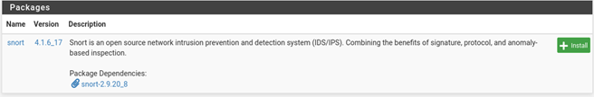

# Firewall & IDS Lab {#firewall-ids}

## Network IP Configuration

| Device          | Interface | IP Address      |
|-----------------|-----------|-----------------|
| Metasploitable  |           | 192.168.56.102  |
| PfSense         | WAN       | 192.168.56.103  |
| PfSense         | LAN       | 192.168.1.1     |
| Kali (Client)   |           | 192.168.1.100   |

## Machines Deployment
### Pfsense

  

  

### Metasploitable

  

### Kali

  

## pfsense configuration
### interface assignment

  

### firewall rule configuration

  

  

### Testing the configuration

  

  

## Installing snort

  

## configure snort

  

